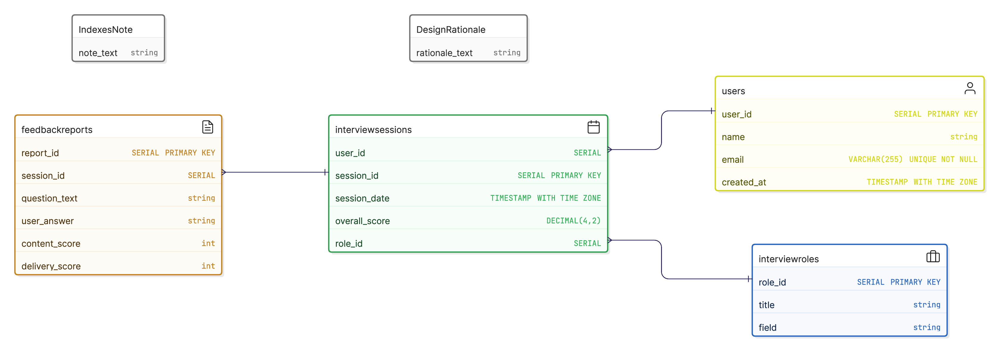
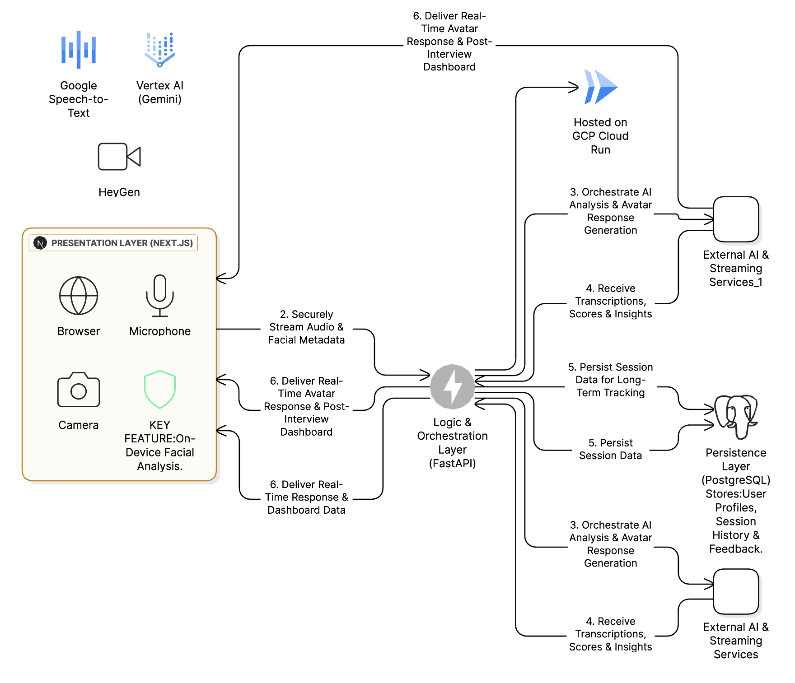

## **AIVA (AI Virtual Interview Assistant): Product & Technical Documentation**

**Version:** 1.0

**Date:** September 6, 2023

**Status:** DRAFT

**Authors:** Mohit Bhimrajka, Bhumi Shah, Yash Navani, Leisha Totani, Tiya Sadhwani, Prisha Tiwari, Shreyas Dole

---

## **Table of Contents**

1. [Introduction & Vision](#1-introduction--vision)
2. [Project Governance & Methodology](#2-project-governance--methodology)
3. [Target Audience & User Personas](#3-target-audience--user-personas)
4. [Measuring Success: Key Performance Indicators (KPIs)](#4-measuring-success-key-performance-indicators-kpis)
5. [Core Features & Functional Requirements (By Phase)](#5-core-features--functional-requirements-by-phase)
6. [Technical Architecture & System Design](#6-technical-architecture--system-design)
7. [Non-Functional Requirements (NFRs)](#7-non-functional-requirements-nfrs)
8. [Risk Assessment & Mitigation Plan](#8-risk-assessment--mitigation-plan)
9. [Future Considerations (v2.0 and Beyond)](#9-future-considerations-v20-and-beyond)

---

### **1. Introduction & Vision**

#### **1.1. Problem Statement**
The traditional interview process is often a "black box" for candidates. Feedback is typically sparse, subjective, or non-existent, leaving individuals unable to identify specific areas for improvement. Furthermore, effective practice is difficult; passive learning (reading books, watching videos) does not simulate the real-world pressure or provide feedback on crucial communication skills such as vocal delivery, clarity, and perceived confidence. Existing tools focus primarily on technical question content (e.g., LeetCode) or simple self-recording, failing to provide a holistic, real-time, and interactive coaching experience.

#### **1.2. Project Vision & Mission**
Our vision is to democratize interview coaching through artificial intelligence. We are creating **AIVA (AI Virtual Interview Assistant)**, a personal AI coach that analyzes not just *what* a candidate says, but *how* they say it.

**Mission Statement:** To provide candidates with objective, actionable, and multi-dimensional feedback on their interview performance, empowering them to build the skills and confidence needed to succeed in their careers.

**Core Value Proposition:** Move **"Beyond the Right Answer"** by analyzing the three pillars of a successful interview: Content Intelligence, Vocal Delivery, and Visual Presence.

---

### **2. Project Governance & Methodology**

#### **2.1. Team Structure & Domain Ownership**
Our team is structured around ownership of core product domains to ensure clear accountability and deep expertise in each critical area of the AIVA experience.

*   **Product & Project Leadership:** This role is responsible for the overall project vision, strategic direction, and execution. Key duties include managing the product backlog, defining and prioritizing user stories, leading sprint ceremonies, and acting as the primary point of contact for stakeholders. This role ensures the team remains aligned with user needs and project timelines.

*   **Core User Experience & Frontend:** This domain team is responsible for everything the user sees, hears, and touches. They will translate user stories and designs into a seamless, intuitive, and responsive interface using Next.js. Their responsibilities include the implementation of the interview UI, user dashboards, and the client-side integration of real-time communication libraries (WebRTC, MediaPipe.js).

*   **AI & Data Intelligence Pipeline:** This domain team is responsible for the "brains" of the AIVA platform. They will develop the FastAPI backend, engineer the prompts for the Gemini model, and manage the entire data flow for analysis. Their work includes processing transcriptions, calculating scores, generating feedback, and ensuring the data pipeline is efficient and accurate.

*   **Real-Time Avatar & Streaming Systems:** This domain team is responsible for creating the life-like, interactive interview experience. Their primary focus is the integration of the HeyGen Streaming Avatar API and the Google Speech-to-Text service. They will manage the real-time, low-latency communication channels (WebSockets) required for a fluid conversational flow.

*   **Data Persistence & Cloud Architecture:** This domain team owns the foundational infrastructure of the project. They are responsible for designing and maintaining the PostgreSQL database schema, ensuring data integrity, and managing the deployment and scaling of all services on Google Cloud Platform (GCP). They will oversee security, reliability, and performance from an infrastructure perspective.

#### **2.2. Development Methodology**
We will adopt an **Agile (Scrum-like) methodology** to ensure iterative progress, adaptability, and frequent feedback loops.
*   **Sprints:** Work will be organized into two-week sprints.
*   **Ceremonies:** Each sprint will include:
    *   **Sprint Planning:** To define the scope and goals for the upcoming sprint.
    *   **Daily Standups:** Brief daily check-ins to sync progress and unblock team members.
    *   **Sprint Review:** To demonstrate completed work to stakeholders (i.e., professors).
    *   **Sprint Retrospective:** To reflect on the process and identify areas for improvement.

#### **2.3. Tooling & Collaboration Stack**
*   **Version Control:** Git, hosted on **GitHub**. All code changes will be managed through Pull Requests with mandatory code reviews.
*   **Project Management:** **Jira** or **Trello** for managing the product backlog, user stories, and sprint boards.
*   **Communication:** **Slack** for daily team communication and coordination.
*   **Design & Prototyping:** **Figma** for UI/UX wireframes and mockups.

---

### **3. Target Audience & User Personas**

We are building AIVA for three primary user segments:

#### **3.1. Persona 1: The University Student**
*   **Name:** Priya, a final-year Computer Science student.
*   **Goal:** To land her first full-time software engineering role at a top tech company.
*   **Pain Points:**
    *   Has strong technical knowledge but limited real-world interview experience.
    *   Feels anxious about behavioral questions and "thinking on her feet."
    *   Receives vague feedback like "be more confident" from university career services, with no clear way to measure or improve it.

#### **3.2. Persona 2: The Career Professional**
*   **Name:** David, a professional with 8 years of experience in finance, looking to pivot into a Product Manager role.
*   **Goal:** To confidently navigate interviews in a new industry and role type.
*   **Pain Points:**
    *   His interview skills are rusty and tailored to a different industry.
    *   Needs to master new terminology and communication styles specific to product management.
    *   Has limited time and needs an efficient, on-demand way to practice.

#### **3.3. Persona 3: The Enterprise (B2B)**
*   **Name:** InnovateCorp HR Department.
*   **Goal:** To standardize the initial candidate screening process and improve the overall candidate experience.
*   **Pain Points:**
    *   The initial screening process is time-consuming for hiring managers.
    *   There is a risk of inconsistency and unconscious bias in early-stage interviews.
    *   Wants to provide a modern, engaging experience that reflects their tech-forward brand.

---

### **4. Measuring Success: Key Performance Indicators (KPIs)**

To ensure we are building a valuable product, we will track the following KPIs:

*   **User Engagement & Adoption:**
    *   **Interviews Completed per User:** Measures the core value proposition. Goal: >2 sessions/user in their first week.
    *   **Feature Adoption Rate:** Percentage of users who complete an interview using advanced feedback features (voice and facial analysis). Goal: >70%.
    *   **User Retention Rate:** Percentage of users who return to the platform within 30 days.

*   **System Performance & Reliability:**
    *   **API Uptime:** Goal: 99.9% uptime for our core backend services.
    *   **Average API Response Time:** For non-streaming requests. Goal: <200ms.
    *   **End-to-End Latency:** Time from user finishing speech to avatar starting response. Goal: <2.5 seconds.

*   **User Satisfaction:**
    *   **Net Promoter Score (NPS):** A direct measure of user satisfaction and likelihood to recommend. Goal: Achieve an NPS of +50 post-launch.

---

### **5. Core Features & Functional Requirements (By Phase)**

This section details the functional requirements, broken down by the development phases.

#### **Phase 1: The Core Interview Loop (MVP)**
*   **Epic: Text-Based Interview & Analysis**
    *   **User Story 1:** As Priya, I want to select a predefined role (e.g., "Python Developer - Junior") from a list so that I can practice for a specific job type.
    *   **User Story 2:** As a user, I want to be presented with text-based questions one by one in a chat-like interface.
    *   **User Story 3:** As a user, I want to type my answer into a text box and submit it for analysis.
    *   **User Story 4:** As David, I want to receive a post-interview report that shows each question, my answer, and an AI-generated score and feedback on the content's quality, relevance, and clarity.

#### **Phase 2: Introducing Voice & Avatar Interactivity**
*   **Epic: Voice-Driven Interaction**
    *   **User Story 1:** As a user, I want to see a life-like avatar ask me questions aloud to better simulate a real interview.
    *   **User Story 2:** As Priya, I want to answer questions using my microphone so I can practice my verbal communication.
    *   **User Story 3:** As a user, I want to see a live transcription of my speech on the screen to confirm the system is hearing me correctly.

#### **Phase 3: Advanced Voice & Facial Analysis**
*   **Epic: Multi-Modal Feedback Engine**
    *   **User Story 1:** As David, I want the system to analyze my speaking pace and count my use of filler words (e.g., "um," "ah") so I can learn to speak more fluently.
    *   **User Story 2:** As Priya, I want to receive a "Confidence Score" based on my facial expressions and engagement, analyzed privately on my device, to see how I appear to an interviewer.
    *   **User Story 3:** As a user, I want my post-interview dashboard to include new visualizations for vocal delivery and confidence levels over the course of the interview.

#### **Phase 4: Scaling, Intelligence & Polish**
*   **Epic: Dynamic & Personalized Experience**
    *   **User Story 1:** As an experienced user, I want the AI to ask dynamic follow-up questions based on my previous answers to create a more challenging and realistic interview.
    *   **User Story 2:** As David, I want to view a history of all my past interview sessions to track my score improvements over time.
    *   **User Story 3:** As Priya, I want to browse an expanded library of interview roles and questions to prepare for a wider range of opportunities.

---

### **6. Technical Architecture & System Design**

The AIVA platform is designed as a modern, scalable, cloud-native application.

#### **6.1. Technology Stack**
*   **Frontend:** Next.js with MediaPipe.js (for on-device analysis)
*   **Backend:** FastAPI (Python)
*   **Database:** PostgreSQL
*   **Deployment:** Docker, GCP Cloud Run
*   **Core AI/ML Services:** GCP Vertex AI (Gemini), Google Cloud Speech-to-Text, HeyGen Streaming Avatar API

#### **6.2. High-Level System Architecture**

**Description:** The system operates on a client-server model hosted entirely on GCP. The Next.js frontend captures user input, which is processed by the FastAPI backend running on the serverless GCP Cloud Run platform. The backend orchestrates calls to specialized third-party APIs for AI/ML tasks and persists all relevant data in a managed PostgreSQL database.

#### **6.3. Data Flow & System Interaction**

**Description:** The diagram above illustrates the real-time communication sequence for a single user response. Key to this design is the parallel processing of AI content analysis (via Vertex AI) and the generation of the next question (via HeyGen), ensuring a fluid, conversational user experience with minimal latency.

#### **6.4. Data Model**

**Description:** Our data is structured in a normalized relational model to ensure data integrity and reduce redundancy. The core entities—Users, InterviewRoles, InterviewSessions, and FeedbackReports—are linked via foreign keys, enabling robust analytics and user progress tracking.

#### **6.5. The AIVA Blueprint: End-to-End System Flow**

The following blueprint synthesizes our entire architecture, illustrating the complete data journey from user input at the presentation layer, through the orchestration and persistence layers, and back to the user as actionable insight.

**Description:** This blueprint synthesizes our entire architecture, illustrating the complete data journey from user input at the presentation layer, through the orchestration and persistence layers, and back to the user as actionable insight.

---

### **7. Non-Functional Requirements (NFRs)**

*   **Performance:**
    *   Live speech-to-text transcription must appear on the user's screen with <500ms latency.
    *   The avatar's response must begin streaming within 2 seconds of the user finishing their answer.
    *   Dashboard pages must load in under 3 seconds.
*   **Scalability:**
    *   The backend architecture (GCP Cloud Run) must automatically scale to handle concurrent user sessions from 1 to 10,000 without manual intervention.
*   **Security:**
    *   All user communication must be encrypted via HTTPS/WSS.
    *   User authentication will be handled via JWT (JSON Web Tokens) with secure refresh token logic.
    *   All sensitive data in the database will be encrypted at rest.
*   **Privacy:**
    *   **Critical:** Raw video footage from the user's camera will **never** be sent to or stored on our servers. Facial analysis is performed exclusively on-device using `MediaPipe.js`. Only the resulting anonymized metadata (e.g., confidence scores, engagement metrics) is sent to the backend.
*   **Usability:**
    *   The user interface must be intuitive, requiring no training for a new user to start their first interview session.

---

### **8. Risk Assessment & Mitigation Plan**

| Risk Category | Risk Description | Likelihood | Impact | Mitigation Strategy |
| :--- | :--- | :--- | :--- | :--- |
| **Technical** | High latency in real-time services causing delays between user speech and avatar response | High | High | Frontend buffering, regional GCP deployment, load testing |
| **Financial** | Uncontrolled API costs from heavy Vertex AI, Speech-to-Text, and HeyGen usage | Medium | High | Rate limiting, billing alerts, caching strategies |
| **User Adoption** | Privacy concerns preventing camera/microphone access | Medium | Medium | Prominent on-device messaging, clear privacy policy, gentle onboarding |
| **Dependency** | HeyGen API outages or breaking changes disabling core features | Low | High | Graceful UI degradation, health checks for external APIs |

---

### **9. Future Considerations (v2.0 and Beyond)**

*   **B2B Enterprise Portal:** A dedicated dashboard for corporate clients (Persona 3) to manage candidate pools, create custom interview templates, and view anonymized analytics.
*   **Multi-Language Support:** Expand AIVA's capabilities to conduct interviews and provide feedback in other languages like Spanish, French, and German.
*   **Job Platform Integration:** Allow users to import job descriptions from platforms like LinkedIn to generate a tailored mock interview.
*   **Deeper Personality & Soft-Skill Analytics:** Utilize advanced NLP to provide insights into a user's communication style (e.g., STAR method usage, positive language).